# Text-to-Speech Support {.unnumbered}

## Text-to-Speech Support {.unnumbered}

There are an increasing number of tools that can read text aloud from a webpage and allow users to listen to the text. Many people who require these tools for everyday use (such as people who have low or no vision) already have robust tools that they use. If you are interested in trying out a text-to-speech tool, which may help you engage with the course materials while you are commuting or otherwise ‘busy’, or if you want to listen to the text while you read, feel free to follow the instructions below.

::: {.accordion title="For Users of MS Edge. Click/tap this banner to show/hide the content."}

Microsoft Edge's Read Aloud feature can enhance comprehension and retention of complex texts by allowing the user to listen while reading. It also offers a hands-free learning experience, making it convenient for focus or for individuals with visual impairments.

These instructions will not apply if you use a browser other than MS Edge.

### Desktop Use

1. Log onto Moodle course page in MS Edge.  
2. Find the shortcut key to Read Aloud on the top right corner.  
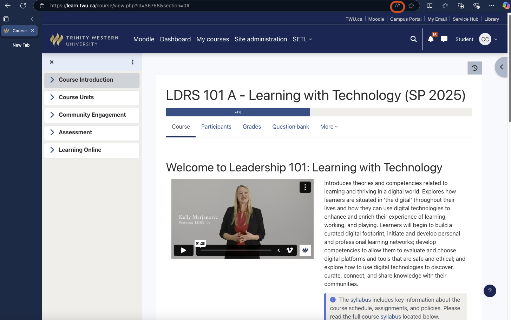  
1. Click on "Voice Options" to adjust the speed.  
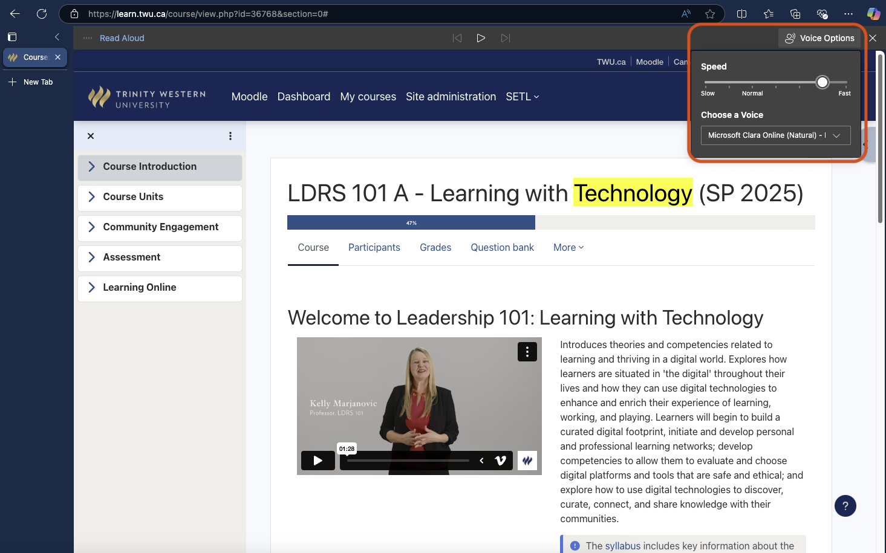

### Android Use
1. After installing Microsoft Edge from the [Play Store](https://play.google.com/store/search?q=edge&c=apps&hl=en){target="_blank"}, log onto Moodle course page.  
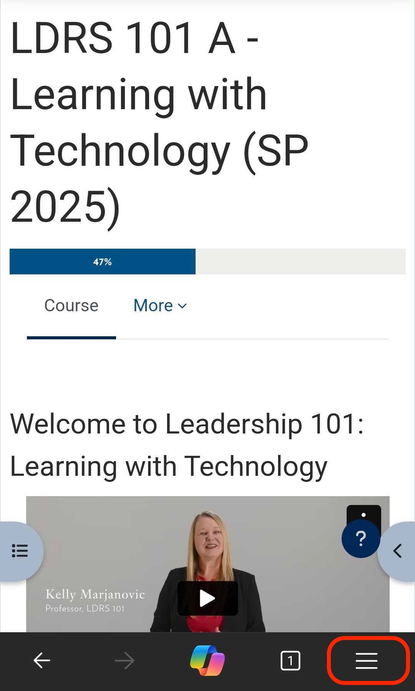  
2. It will start reading the page out loud.  
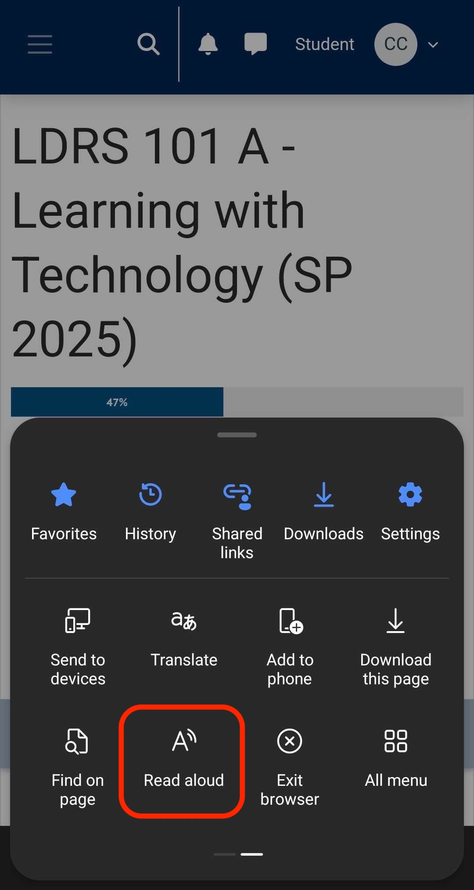  
3. Click on top right icon to adjust speed and voice.  
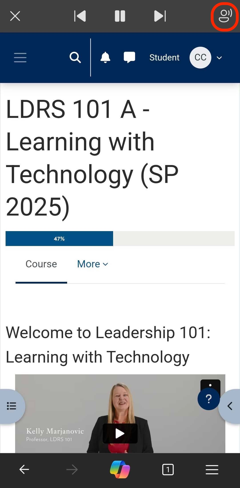  
4. More setting options.  
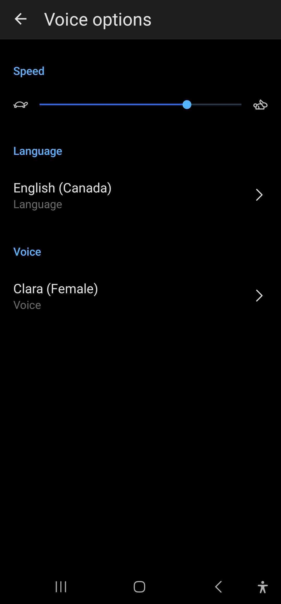

:::

::: {.accordion title="For IPhone users. Click/tap this banner to show/hide the content."}

1. Settings > Accessibility > Spoken Content. From there, you can turn on Speak Selection or Speak Screen.  
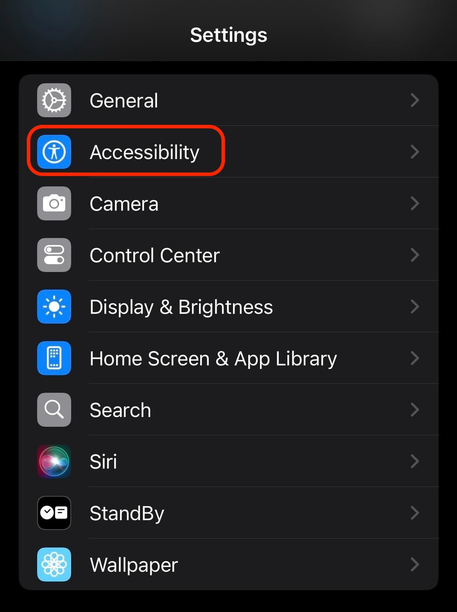  
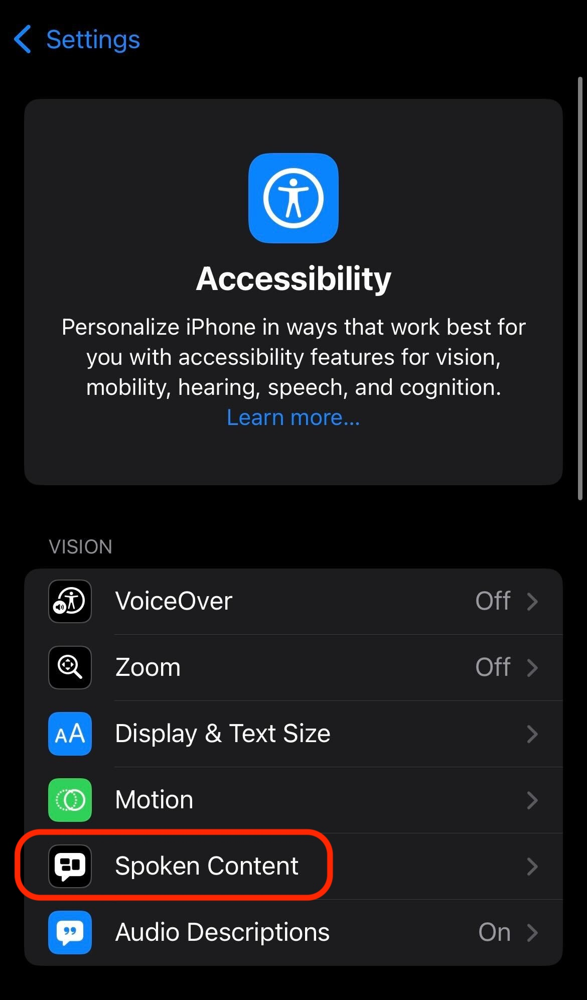  
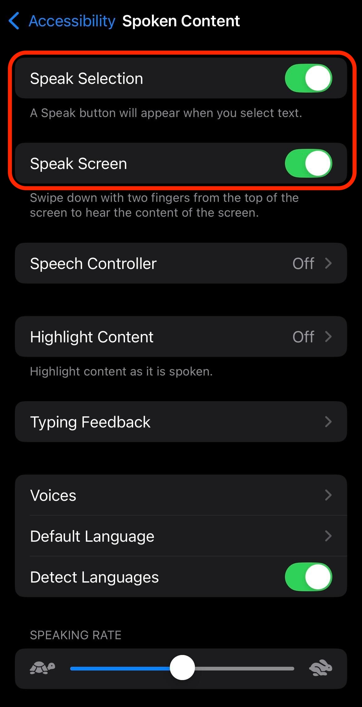  
2. After logging onto the Moodle site on your Safari, a speak button will appear when you select text.  
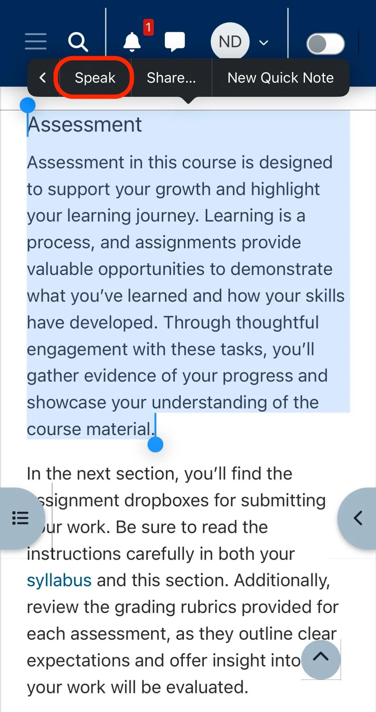  
3. Swipe down with two fingers from the top of the screen to hear the content of the screen.  
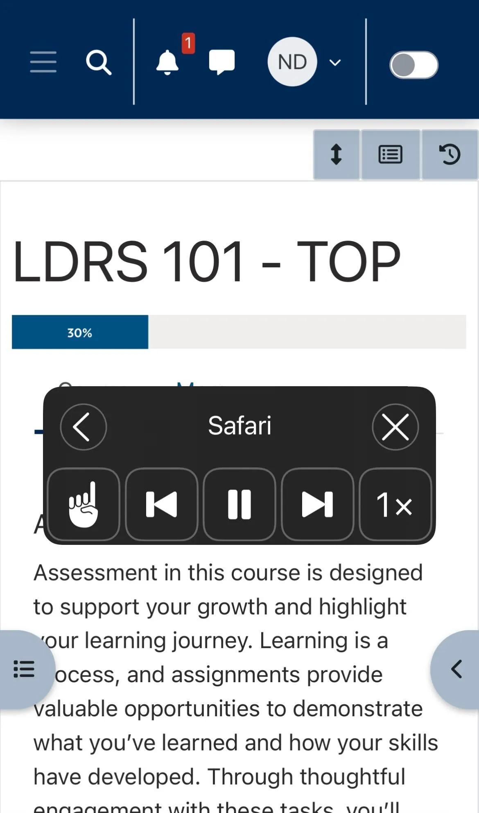

:::

<!-- ### For Users of Chrome

1. We recommend installing [UI Options Plus (UIO+)](https://chromewebstore.google.com/detail/ui-options-plus-uio%2B/okenndailhmikjjfcnmolpaefecbpaek?pli=1){target="_blank"} extension for text-to-speech support. 2. Click "extensions" on the top right corner. Then choose [UI Options Plus (UIO+)](https://chromewebstore.google.com/detail/ui-options-plus-uio%2B/okenndailhmikjjfcnmolpaefecbpaek?pli=1) and the extension will pop up.  

3. Turn to option 10, and set to "On".  

4. Highlight the paragraph you would like to play audio, a play icon will show up. To troubleshoot, refresh the browser.  
-->

If you want information on another tool, please reach out to [elearning@twu.ca](mailto:elearning@twu.ca).

<!-- <h2>Text-to-Speech Support</h2>

There are an increasing number of tools that can read text aloud from a webpage and allow users to listen to the text. Many people who require these tools for everyday use (such as people who have low or no vision) already have robust tools that they use. If you are interested in trying out a text-to-speech tool, which may help you engage with the course materials while you are commuting or otherwise ‘busy’, or if you want to listen to the text while you read, feel free to follow the instructions below.

    
<strong>For Users of MS Edge</strong> - Click to expand

    Microsoft Edge's Read Aloud feature can enhance comprehension and retention of complex texts by allowing the user to listen while reading. It also offers a hands-free learning experience, making it convenient for focus or for individuals with visual impairments.

    These instructions will not apply if you use a browser other than MS Edge.
      <strong>Desktop Use</strong> Log onto Moodle course page in MS Edge.
     Find the shortcut key to Read Aloud on the top right corner.&nbsp;  Click on "Voice Options" to adjust the speed.    <strong>MS Edge - Android Use</strong>  After installing Microsoft Edge from the <a href="https://play.google.com/store/search?q=edge&amp;c=apps&amp;hl=en" target="_blank">Play Store,</a> log onto Moodle course page.&nbsp;    It will start reading the page out loud.  Click on top right icon to adjust speed and voice.&nbsp;  More setting options.   

    
<strong>For IPhone users</strong> - Click to expand

    Settings &gt; Accessibility &gt; Spoken Content.&nbsp; From there, you can turn on Speak Selection or Speak Screen.&nbsp;   &nbsp;     After logging onto the Moodle site on your Safari, a speak button will appear when you select text.   Swipe down with two finders from the top of the screen to hear the content of the screen.

    
<strong>For Users of Chrome</strong> - Click to expand  

    
We recommend installing&nbsp;<a href="https://chromewebstore.google.com/detail/ui-options-plus-uio%2B/okenndailhmikjjfcnmolpaefecbpaek?pli=1" target="_blank">UI Options Plus (UIO+)</a>&nbsp;extension&nbsp;for text-to-speech support. After installation, click "extensions" on the top right corner. Then choose&nbsp;<a href="https://chromewebstore.google.com/detail/ui-options-plus-uio%2B/okenndailhmikjjfcnmolpaefecbpaek?pli=1" target="_blank">UI Options Plus (UIO+)</a>&nbsp;and the extension will pop up.&nbsp;   

    
Turn to option 10, and set to On.&nbsp;  

    
Highlight the paragraph you would like to play audio, a play icon will show up. To troubleshoot, refresh the browser.

    
 

&nbsp;If you want information on another tool, please reach out to <a href="mailto:elearning@twu.ca" target="_blank">elearning@twu.ca</a>.

 -->